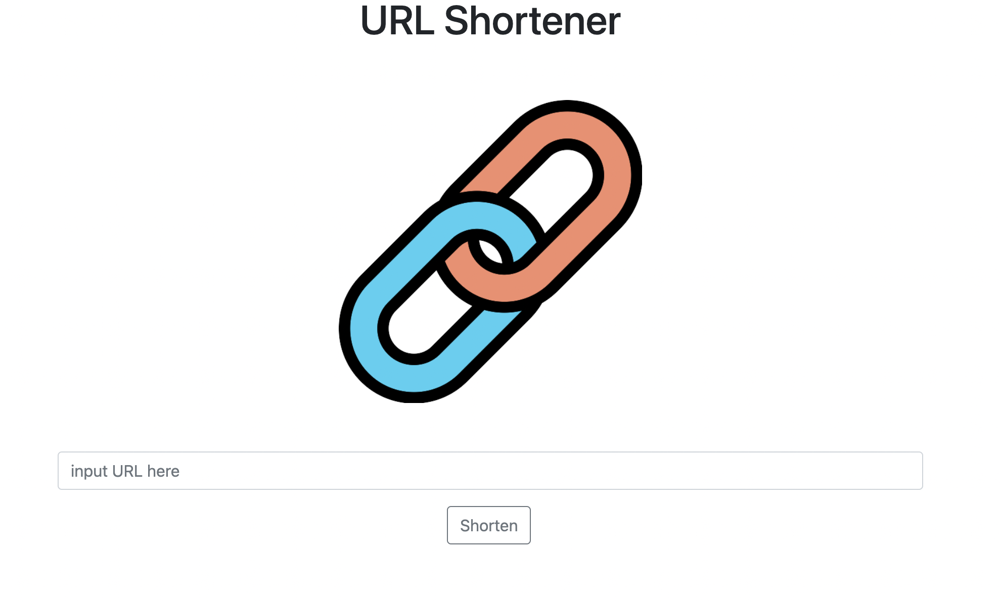

# shorten-URL



## 介紹

短網址產生器

### 功能

- 將原有網址轉換成短網址
- 可直接點擊短網址開啟新分頁
- 點擊"copy"可複製短網址

## 開始使用

1. 請先確認有安裝 node.js 與 npm
2. 將專案 clone 到本地
3. 在本地開啟之後，透過終端機進入資料夾，輸入：

   ```bash
   npm install
   ```

4. 安裝完畢後，繼續輸入：

   ```bash
   npm run start
   ```

5. 若看見此行訊息則代表順利運行，打開瀏覽器進入到以下網址

   ```bash
   Listening on http://localhost:3000
   ```

6. 若欲暫停使用

   ```bash
   MACOs com + c
   Win ctrl + c 
   ```

## 開發工具

- Node.js 14.16.0
- Express 4.17.2
- Express-Handlebars 6.0.2
- mongoose 6.1.8
- Bootstrap 5.1.3